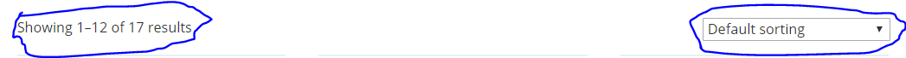

 ## [Wordpress Theme Development Step By Step](https://codex.wordpress.org/Theme_Development)

[Create a basic templete](https://codex.wordpress.org/Theme_Development#Basic_Templates)

 1. create a style.css [*comment the details there*](https://codex.wordpress.org/Theme_Development)
 2. Thembnail of theme name **screenshot.png** 
 3. add before all css, js and images ```<?php echo get_stylesheet_directory_uri(); ?>```  [*know more*](https://codex.wordpress.org/Function_Reference)
 4. create a folder **inc**
 5. cut header from index.php [create](https://codex.wordpress.org/Theme_Development#Template_File_Checklist) **header.php** in root and paste the header code
 6. in index.php above all code ```<?php get_header(); ?>``` [*know more*](https://codex.wordpress.org/Function_Reference/get_header)
 7. cut footer code and make **footer.php** paste the code [know mone](https://codex.wordpress.org/Function_Reference/get_footer)
 8. add this code ```<?php get_footer(); ?>``` below all code of index.php
 9. cut sidebar code create one more file **sidebar.php** paste the code
 10. add ```<?php get_sidebar(); ?>``` inside **index.php** in place of [sidebar](https://developer.wordpress.org/reference/functions/get_sidebar/)
 12. before ending head tag [<?php wp_head(); ?>] [*know more*](https://codex.wordpress.org/Function_Reference/wp_head)
 13. before ending body tag ```<?php wp_footer(); ?>``` [*know more*](https://codex.wordpress.org/Function_Reference/wp_footer)
 14. wp-admin -> users -> your profile -> we can uncheck toolbar menu
 15. create new folder in root **template-parts** (*not necessary*)
 16. create more folder inside **template-parts** name **header, footer, sidebar** 
 17. ```<?php get_template_part( 'partials/content', 'page' ); ?>``` [*know more*](https://codex.wordpress.org/tr:Fonksiyon_Referans/get_template_part)
 18. in html beginnin tag ```<?php language_attributes(); ?> class="no-js no-svg"``` [see all](https://codex.wordpress.org/Theme_Development#Document_Head_.28header.php.29)
 19. title```<title><?php bloginfo("name"); ?></title>``` [know more about bloginfo](https://developer.wordpress.org/reference/functions/get_bloginfo/)
 20. create **functions.php** in root [*know more*](https://developer.wordpress.org/themes/basics/theme-functions/)
 21. dynamic title from **functions.php**  ```add_theme_support( "title-tag" )``` [*know more*](https://codex.wordpress.org/Theme_Features)
 22. secure url ```esc_url(get_stylesheet_directory_uri());``` [know more](https://codex.wordpress.org/Function_Reference/esc_url)
 23. add main **style.css** above wp_head() function ```<?php echo get_stylesheet_uri(); ?>``` [*know more*](https://codex.wordpress.org/Function_Reference/get_stylesheet_uri)
 24. wp-admin -> settings -> media *make everything blank* to first the site
 25. wp-admin -> settings -> permalinks -> *post name* this is seo friendly
 26. enqueue scripts and style [*here*](https://developer.wordpress.org/reference/functions/wp_enqueue_script/)
 ```wp_enqueue_style( $handle, $src, $deps, $ver, $media );```
 ***and***
 ```wp_enqueue_script( $handle, $src, $deps, $ver, $in_footer );``` 
 27. *$var* set true = call in footer, false = call in header
 27. ```get_theme_file_uri("location")``` [*know more*](https://codex.wordpress.org/Function_Reference/get_theme_file_uri)
 28. this way we can override **style.css** ```wp_enqueue_style( 'stylesheet', get_stylesheet_uri()); ``` below all enqueue style


## [Default Page](https://codex.wordpress.org/Pages)

 29. Customizing **page.php** -> add ```get_header();``` & ```get_footer();``` there. **page.php** file is for single default page
 30. Create a file **right-sidebar.php** and paste all sidebar code
 31. from dashboad add new page and view that page that will be **page.php**
 32. add sidebar ```<?php get_template_part("template-parts/sidebar/right-sidebar", "sidebar-right"); ?>```
 33. create a folder in **template-parts** name **content** and inside that folder create **content.php** and paste main content code
 34. go to dashboard -> About Us -> edit page title and descriptions
 35. Print those content of the page by using [loop](https://codex.wordpress.org/The_Loop_in_Action)
 36. [```get_the_content();```](https://codex.wordpress.org/Function_Reference/get_the_content) [```have_posts();```](https://codex.wordpress.org/Function_Reference/have_posts) [```the_post();```](https://codex.wordpress.org/Plugin_API/Action_Reference/the_post) Use those to dynamic page

 ### [Create custom page](https://developer.wordpress.org/themes/template-files-section/page-template-files/)

 37. page.php is default page. I wil create custom page **about.php** inside root write all the code [*know more*](https://developer.wordpress.org/themes/template-files-section/page-template-files/)
 38. inside comment name the template
 ```
 <?php get_header(); 
 /*
 Template Name: About Us
 */
 ?>
 ```  
 39. from dashboard -> page -> add new -> Page atributes -> template -> select the name of your page
 
 ### [Custom Menu](https://codex.wordpress.org/WordPress_Menu_User_Guide)

 40. inside **functions.php** create a function and call ```add_action()``` *(know more*)[https://codex.wordpress.org/Navigation_Menus]
 41. refresh dashboard there will new options **Menus**
 42. Dashboard -> Menus -> create a new menu -> Set menu name -> If we save there will be a option display location
 43. Dashboard -> Menus -> Most recent -> mark and add to menu (if necessary)
 44. create one more menu **Top** . Go to  Dashboard -> Menus -> Manage Location 
 45. *Select a menu to edit* there will be two menu now

### Dynamically display menu

 46. use ```wp_nav_menu()``` [*know more*](https://developer.wordpress.org/reference/functions/wp_nav_menu/)

### [image support](https://codex.wordpress.org/Post_Thumbnails)

 47. in **functions.php** add ```add_theme_support("post-thumbnails");``` in dashboard -> new post there will be a option for image
 48. custom image setup ```set_post_thumbnail_size('name', 'width', 'heaght', 'crop');``` include this in below ```add_theme_support();```
 49. [*thumbnail image size*](https://codex.wordpress.org/Function_Reference/set_post_thumbnail_size), [*image size*](https://codex.wordpress.org/User:Esmi/add_image_size())
 50. Go to Wordpress project folder -> wp-content-> uploads -> see uploaded file size

### [widget](https://codex.wordpress.org/Widgets_API)

 51. from **footer.php** we want *Corporation* title to be a dynamic one
 52. create a ```register_sidebar``` function in **functions.php** for make a sidebar widget [*know more*](https://codex.wordpress.org/Function_Reference/register_sidebar)
 53. dashboard -> appearance -> widget -> there will be a new footer widget 
 54. drag a navigation menu into footer widget. give a title and set to main menu
 55. to display widget content add ```<?php dynamic_sidebar("footer_widget_one"); ?>``` in **footer.php**
 56. go to widgets -> add text into footer widget one -> tab text option -> write html code like: list item and all code [*know more*](https://codex.wordpress.org/WordPress_Widgets#Existing_Widgets_in_Existing_Widget_Areas)


### [Woocommerce setup](https://wordpress.org/plugins/woocommerce/)

[*official docs woocommerce*](https://docs.woocommerce.com/documentation/plugins/woocommerce/getting-started/) [*official github page*](https://github.com/woocommerce/woocommerce)
 57. donwload woocommerce from <wordpress.org> , unzip it and include woocommerce folder to ```project-root/wp-content/plugins```
 58. refresh dashboard and click on plugins -> activate woocommerce and fill initial basic info. latter on we can change [*know more*](https://docs.woocommerce.com/document/start-with-woocommerce-in-5-steps/)
 59. in dashboard there will be some error we can fix that letter
 60. dashboard -> woocommerce -> [*all setting details*](https://docs.woocommerce.com/document/configuring-woocommerce-settings/)
  - order -> add new for making manual order.
  - Coupons for some descount
  - reports for showing the performance ot the shop
  - setting all setting we can setup and update from there
 61. dashboard -> product -> [*all setting*](https://docs.woocommerce.com/document/managing-products/)
  - product -> crete first product

### theme support and style for woocommerce plugin

 62. in **functions.php** create ```add_theme_support( $feature );```  we already used it before. [*know more*](https://developer.wordpress.org/reference/functions/add_theme_support/)
 63. from **header.php** remove all class and add ```<?php body_class(); ?>``` it will get default style [*know more*](https://woocommerce.wp-a2z.org/oik_api/body_class/)
 64. copy **page.php** and rename **woocommerce.php** afterward remove while loop and all content inside loop [*know more*](https://docs.woocommerce.com/document/third-party-custom-theme-compatibility/)
 65. replace loop with ```<?php woocommerce_content(); ?>``` and reload shop page and click on a product [*know more*](https://woocommerce.wp-a2z.org/oik_api/woocommerce_content/)
 66. all product -> edit any product -> add shiping info that will add some additional info [*custom page view setup*](https://docs.woocommerce.com/document/editing-product-data-tabs/) , [*know more*](https://docs.woocommerce.com/document/per-product-shipping/)
 67. all product -> edit any product -> Linked product -> Upsells -> product name -> it will display in singel product page as related product [*know more*](https://docs.woocommerce.com/document/related-products-up-sells-and-cross-sells/)

### import dummy data for product

 68. collect dummy data from ```htdocs\project\wp-content\plugins\woocommerce\sample-data\sample_products.xml``` (use sample_products.csv for data with image) capy and paste in desktop
 69. dashboards -> tools -> import -> wordpress install now -> run importer -> upload that xml file -> give wp admin name -> existing user admin [*know more*](https://docs.woocommerce.com/document/importing-woocommerce-sample-data/)
 70. dashboards -> tools -> import -> woocommerce products (csv) -> run importer -> upload that csv file -> cloumn maping let that be default [*know more*](https://docs.woocommerce.com/document/importing-woocommerce-sample-data/)
 71. dashboards -> tools -> import -> woocommerce tax rates csv -> 

 ### [Woocommerce custom theme](https://docs.woocommerce.com/document/woocommerce-theme-developer-handbook/)

 72. *shop page turn into home* settings -> reading -> your homepage displays -> a static page -> Shop [*know more*](https://docs.woocommerce.com/document/woocommerce-pages/)
 73. ```htdocs\project\wp-content\plugins\woocommerce\templates\archive-product.php``` customize this for diffrent page style diffrent. Example: in shop page catagory section in right side and in details catagory in left side [*know more*](https://docs.woocommerce.com/document/template-structure/)
 74. when woocommerce.php delete there will show [**archive-product.php**](https://github.com/woocommerce/woocommerce/blob/master/templates/archive-product.php)
 75. We will no longer use woocommerce.php for this project so create a backup file with any name and delete **woocommerce.php**
 76. when we override woocommerce theme and update our over written code will be gone for that ```htdocs\root\wp-content\plugins\woocommerce``` from there copy templates folder and paste it in our theme root folder ```htdocs\project\wp-content\themes\root``` here and name it **woocommerce**
 77. create one more menu **Home** by appearance -> menus -> custom links -> paste home url, Home and add to menu
 78. display archive-product.php sidebar ``` do_action( 'woocommerce_sidebar' );``` [*know more*](https://codex.wordpress.org/Function_Reference/do_action_ref_array)

 ### design shop page

 79. to remove the breadcurmbs from middle of shop page in **functions.php** ```remove_action();``` [*know more*](https://codex.wordpress.org/Function_Reference/remove_action) [*example*](https://docs.woocommerce.com/document/third-party-custom-theme-compatibility/)
 80. ```<?php echo esc_url(home_url('/')); ?>``` use this to display home directory location [*know more*](https://codex.wordpress.org/Function_Reference/esc_url) [*home url*](https://codex.wordpress.org/Function_Reference/home_url)
 81. in css folder create a css file and in **functions.php** add one more enqueue style for that 
 82. ```root/woocommerce/loop/add-to-cart.php``` this file is for custom add to cart button design
 83. for shop page which element I want to design right click on it and inspect element and make style theme from inspect element style and copy css code with class name and paste in css file we made
 84. ```<?php woocommerce_breadcrumb(); ?>``` use this function in **archive-product.php** to show directory dynamically [*know more*](https://docs.woocommerce.com/document/woocommerce_breadcrumb/)
 84. Change breadcurmb default from **functions.php** add a filter [*know more*](https://docs.woocommerce.com/document/customise-the-woocommerce-breadcrumb/)
 85. to remove header title shop from **archive-product** make this peremeters false or comment those lines
 ```<?php if ( apply_filters( 'woocommerce_show_page_title', false ) ) : ?>```
 86. to remove 
 87. [*find visual hook guide*](https://businessbloomer.com/woocommerce-visual-hook-guide-archiveshopcat-page/) and search it in **archive-product.php**
 88. ```remove_action( 'woocommerce_before_shop_loop', woocommerce_result_count', 20 );```
 89. ```remove_action( 'woocommerce_before_shop_loop', 'woocommerce_catalog_ordering', 30 );``` [*know more*](https://businessbloomer.com/woocommerce-visual-hook-guide-archiveshopcat-page/)

 ### [pagination design](https://docs.woocommerce.com/document/woo_pagination/)

 90. we can see all hook from **archive-product.php** remove that like result and sort we removed
 91. [*add custom pagination*](https://github.com/woocommerce/woocommerce/blob/master/templates/loop/pagination.php) from **functions.php** created a function but don't `add_action` or `add_filter` this is diffrent function . Copy the function name and paste in place of inbuilt pagination from **archive-product.php**


 ## [product per page](https://docs.woocommerce.com/document/change-number-of-products-displayed-per-page/)

 


